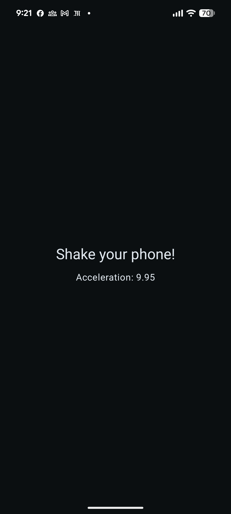
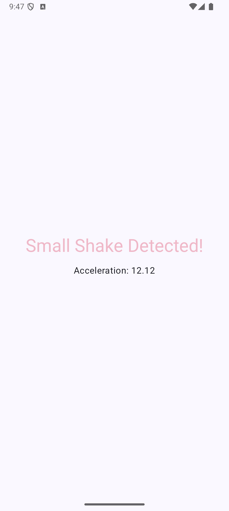
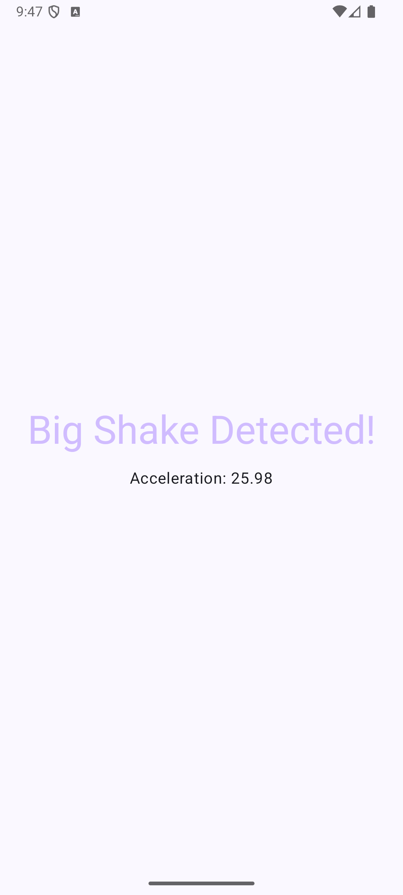

# Shake Detector Light

An Android app that detects when you shake your phone, classifies the shake as
**small** or **big**, gives haptic feedback (vibration), and shows the live
accelerometer magnitude on screen.

Its distinguishing feature is not the app itself but **how it is built**: it is
a fully working example of a project using **Lightbuild**, Google's new
declarative build system, driven entirely from the **Android CLI** — no Gradle
files anywhere in the repository.

```
Shake your phone!          →  resting (magnitude ≈ 9.81, gravity)
Small Shake Detected!      →  magnitude > 11   (pink, vibrates)
Big Shake Detected!        →  magnitude > 16   (purple, vibrates)
```

| Idle (dark theme, on device) | Small shake | Big shake |
|:---:|:---:|:---:|
|  |  |  |

The small- and big-shake captures were taken on an emulator while driving the
virtual accelerometer (`adb emu sensor set acceleration x:y:z`) — a handy way
to test sensor apps without physically shaking anything.

## Technologies used

### Build system: Lightbuild

[Lightbuild](https://developer.android.com/tools/agents/lightbuild) is a
declarative, YAML-based build configuration currently available to trusted
testers. Instead of imperative Gradle scripts, the whole build is described by:

| File | Role |
|---|---|
| `project.lightbuild.yaml` | Project name, module list, repositories, Kotlin/Java versions, Lightbuild version |
| `app/lightbuild.yaml` | Application module: `applicationId`, SDK levels, dependency on `//ui` |
| `ui/lightbuild.yaml` | Library module: Maven dependencies, unit/instrumented test configuration |
| `*/resolved.deps` | Pinned dependency resolution files for reproducible, offline-capable builds |

Behind the scenes Lightbuild converts these files to another build system that
performs the actual build; you only ever edit the YAML.

**Enabling it:** the feature is gated behind an environment variable:

```sh
export ANDROID_CLI_BUILD=true
```

### Tooling: Android CLI

The [Android CLI](https://developer.android.com/tools/agents/android-cli)
(`android`) is used for the complete development loop:

```sh
android create empty-activity-lightbuild --name="..." --output=...   # scaffold
android build                # build all modules
android build test           # run unit tests
android build clean          # clean outputs and caches
android run --apks=app/build/outputs/apk/debug/app-debug.apk         # deploy
```

### App stack

- **[Kotlin](https://kotlinlang.org/)** — 100% Kotlin sources.
- **[Jetpack Compose](https://developer.android.com/compose)** — declarative UI toolkit; the whole UI is composables, no XML layouts.
- **[Material 3](https://developer.android.com/develop/ui/compose/designsystems/material3)** — theming (dynamic color on Android 12+, light/dark themes) and typography.
- **[Navigation 3](https://developer.android.com/guide/navigation/navigation-3)** — the new Compose-native navigation library (`NavDisplay` + a type-safe, serializable back stack).
- **[SensorManager](https://developer.android.com/develop/sensors-and-location/sensors/sensors_motion)** — raw `TYPE_ACCELEROMETER` events; the shake magnitude is `sqrt(x² + y² + z²)`. The listener is registered/unregistered with the composable lifecycle via `DisposableEffect`.
- **[Vibrator / VibratorManager](https://developer.android.com/reference/android/os/VibratorManager)** — haptic feedback on shake detection, with API-level-aware fallbacks down to `minSdk 24`.
- **Edge-to-edge** — `enableEdgeToEdge()` + `safeDrawingPadding()`.

### Module structure

```
app/   → application shell (manifest, applicationId, depends on //ui)
ui/    → library module with all Compose UI, sensors logic, and tests
```

## Testing

### Unit tests (`ui/src/test`)

The shake-classification logic is a pure function (`classifyShake` in
`ShakeLevel.kt`), tested on the JVM without any device:

```sh
android build test
```

`ShakeLevelTest` covers rest/gravity, both thresholds as exclusive bounds, and
values just above each threshold.

### UI tests (`ui/src/androidTest`)

`ShakeDetectorScreenTest` uses the **Compose testing APIs**
(`createAndroidComposeRule`, `onNodeWithText`) with **AndroidJUnitRunner** to
verify each UI state renders the right message. The screen is split into a
stateful wrapper (`ShakeDetectorScreen`) and a stateless
`ShakeDetectorContent(shakeLevel, acceleration)` so tests can drive every state
deterministically — no need to physically shake the test device.

Run them on a connected device/emulator with:

```sh
android build                # assembles ui-debug-androidTest.apk
adb install -r ui/build/outputs/apk/androidTest/debug/ui-debug-androidTest.apk
adb shell am instrument -w com.jpcottin.shakedetectortest.test/androidx.test.runner.AndroidJUnitRunner
```

### Composable previews

`ShakeDetectorPreviews.kt` provides `@Preview`s for every state (idle, small
shake, big shake, and dark mode) rendered in Android Studio's preview panel —
another benefit of the stateless-content split.

## Getting started

1. Install the [Android CLI](https://developer.android.com/tools/agents/android-cli):
   ```sh
   curl -fsSL https://dl.google.com/android/cli/latest/darwin_arm64/install.sh | bash
   ```
2. Enable Lightbuild support:
   ```sh
   export ANDROID_CLI_BUILD=true
   ```
3. Build, test, and deploy:
   ```sh
   android build
   android build test
   android run --apks=app/build/outputs/apk/debug/app-debug.apk
   ```

The project also opens in recent Android Studio preview builds with Lightbuild
support.
