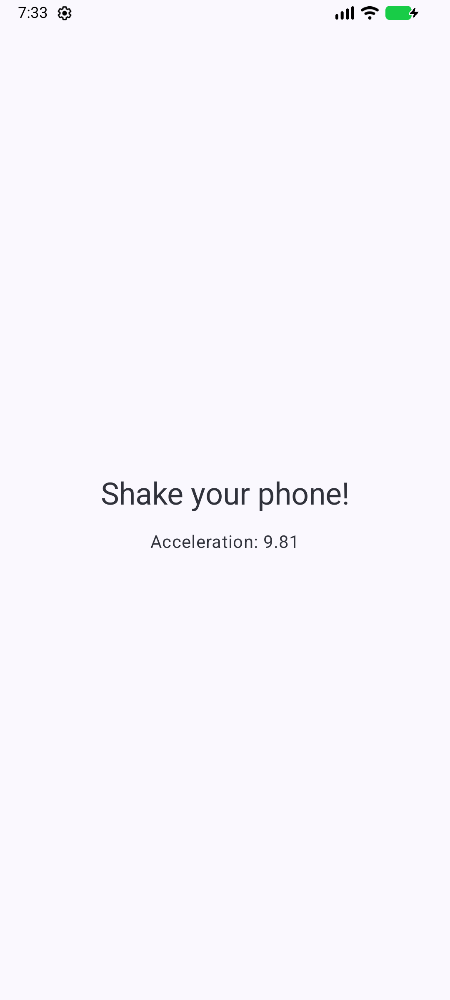
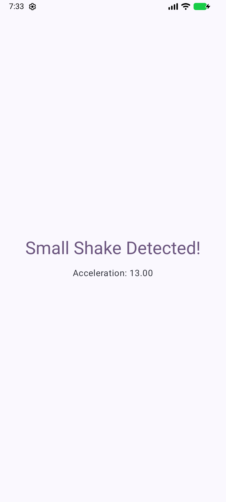
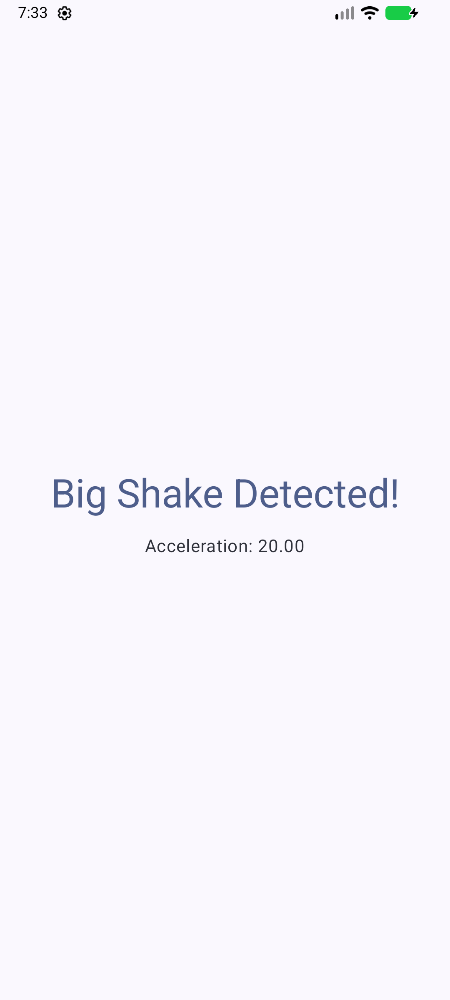

# Shake Detector Light

[](https://github.com/jpcottin/ShakeDetectorLight/actions/workflows/ci.yml)

An Android app that detects when you shake your phone, classifies the shake as
**small** or **big**, gives haptic feedback (vibration), and shows the live
accelerometer magnitude on screen.

Its distinguishing feature is not the app itself but **how it is built**: it is
a fully working example of a project using **Lightbuild**, Google's new
declarative build system, driven entirely from the **Android CLI** — no Gradle
files anywhere in the repository.

```
Shake your phone!          →  resting (magnitude ≈ 9.81, gravity)
Small Shake Detected!      →  magnitude > 11   (pink, vibrates)
Big Shake Detected!        →  magnitude > 16   (purple, vibrates)
```

| Idle | Small shake | Big shake |
|:---:|:---:|:---:|
|  |  |  |

All three captures were taken on an emulator while driving the virtual
accelerometer (`adb emu sensor set acceleration x:y:z`) — a handy way to test
sensor apps without physically shaking anything. Note that the shake colours
come from the Material 3 scheme, so with dynamic colour on Android 12+ they
follow the device wallpaper rather than being fixed pink/purple.

## Technologies used

### Build system: Lightbuild

[Lightbuild](https://developer.android.com/tools/agents/lightbuild) is a
declarative, YAML-based build configuration currently available to trusted
testers. Instead of imperative Gradle scripts, the whole build is described by:

| File | Role |
|---|---|
| `project.lightbuild.yaml` | Project name, module list, repositories, Kotlin/Java versions, Lightbuild version |
| `app/lightbuild.yaml` | Application module: `applicationId`, SDK levels, R8 release optimization, dependency on `//ui` (module dependencies keep the `//` prefix; build targets no longer do) |
| `ui/lightbuild.yaml` | Library module: Maven dependencies, unit/instrumented test configuration |
| `*/resolved.deps` | Pinned dependency resolution files for reproducible, offline-capable builds (regenerate with `android build resolve` — see below) |

The full set of keys Lightbuild accepts is described by the JSON schemas bundled
inside its own jar (`lightbuild.yaml.schema.json` and
`project.lightbuild.yaml.schema.json`) — handy when the online docs are thin.
Since 0.0.20-alpha01 the distribution is a single `lightbuild-daemon` binary
that unpacks itself under `~/.android/lightbuild/daemon-bundles/`; the schemas
live in `repo/com/google/lume/lightbuild-private-api/<version>/*.jar` there.
You can also read exactly what your YAML was translated into: Lightbuild writes
the generated Gradle build to `.lightbuild/gradle/` (gitignored), which is the
quickest way to confirm a key actually took effect.

#### R8 / release optimization

Release builds are shrunk and obfuscated:

```yaml
android:
  packaging:
    release:
      optimization:
        enable: true
        keepRules:
          includeDefault: true
```

`includeDefault` pulls in the default keep rules, which matter here because the
Navigation 3 back stack is serialized via `kotlinx.serialization`. The effect is
large for a demo app — **961 KB** release APK against 21.3 MB for debug — and
`app/build/outputs/mapping/release/mapping.txt` is produced for deobfuscating
release stack traces (CI archives it).

#### Alpha rough edges found while building this

Schema-valid keys that misbehave, verified by inspecting the generated Gradle
and by experiment (first on 0.0.10-alpha01, re-checked on 0.0.20-alpha01):

| Key | Behaviour |
|---|---|
| `kotlin.allWarningsAsErrors` | Accepted; never reaches the compiler — a deliberate unused-variable warning still builds, on 0.0.20-alpha01 too. Left in the config so it takes effect once implemented. |
| `kotlin.jvmTarget` | **Fixed in 0.0.20-alpha01**: a quoted `"17"` validates. On 0.0.10-alpha01 it failed as *"integer found, string expected"* however it was written, because the YAML parser coerced the string to an integer before the schema check. Project-level `build.java.version` drives it here either way. |

#### Migrating 0.0.10-alpha01 → 0.0.20-alpha01

The Lightbuild version is pinned in `project.lightbuild.yaml`
(`lightbuild.version`), and the CLI downloads exactly that version — CI
included — so a new release is never picked up on its own. Bumping the pin
to 0.0.20-alpha01 broke three things at once:

1. **Module schema.** `dependencies` and `tests` are no longer top-level keys
   of `lightbuild.yaml`; they moved inside the `android` block. The old layout
   fails with *"property 'dependencies' is not defined in the schema"*.
2. **Target names.** The `//module:main:apk:debug` style is gone. Targets have
   no `//` prefix and are named after the artifact they produce (see the table
   below); every old name fails with *"Target … not found"*, and
   `query "//..."` returns *"No targets found"* — the pattern is now `"..."`.
3. **`android build test` needs a target.** Bare, it fails with *"Target is
   required for command test"*; unit tests are `android build test
   "ui:hostTest"`.

One regression comes with it: `android build test`, `android build query` and
`android build resolve` first run a target-less `build`, which the new
Lightbuild rejects. They therefore print *"Fatal: Build Failed … Target is
required for command build"* **before** doing their real work and succeeding.
On CLI 1.0.16261425 that was only noise for anything grepping the output; since
CLI 1.0.16457483 it also decides the exit code (see *Exit codes you cannot
trust* below).

Two behavioural surprises, both triggered by simply declaring an
`android.packaging.release` block and neither warned about:

1. **It used to change what a bare `android build` builds**, from
   `//app:buildDebug` to `//app:buildRelease` (0.0.10-alpha01 names), so the
   debug APK stopped
   appearing under `app/build/outputs/apk/debug/`. Since Android CLI
   1.0.16261425 the story is different but no better: a bare `android build`
   builds *nothing* — it prints the command's usage and exits 0 (still the
   case on 1.0.16457483), so a CI step that relies on it silently does no
   work. `android build "app"` (an alias
   for `app:app-debug.apk`) builds the debug APK regardless of the packaging
   block. CI names the debug target explicitly either way.
2. **It drops the `.debug` applicationId suffix from debug builds.** The debug
   applicationId goes from `com.jpcottin.shakedetectortest.debug` back to
   `com.jpcottin.shakedetectortest`, so debug and release builds can no longer
   be installed side by side. Lightbuild exposes no `applicationIdSuffix` key,
   so this cannot currently be configured back.

#### Discovering targets

`android build query "..."` lists every target with its command and a
description (Lightbuild 0.0.20-alpha01 names; the 0.0.10-alpha01 equivalent is
in the right-hand column):

| Target | Builds | Was (0.0.10-alpha01) |
|---|---|---|
| `app`, `app:app-debug.apk` | Debug APK (also copied to `app/build/app-debug.apk`) | `//app`, `//app:main:apk:debug` |
| `app:app-release.apk` | Release APK (R8) | `//app:main:apk:release` |
| `app:app-debug.aab`, `app:app-release.aab` | App bundles | `//app:main:bundle:debug`, `//app:main:bundle:release` |
| `ui`, `ui:ui.aar` | Release AAR — the bare `ui` target also builds the unit and instrumented tests | `//ui`, `//ui:main:aar:release` |
| `ui:hostTest` | Unit tests (`android build test "ui:hostTest"` runs them) | `//ui:test` |
| `ui:deviceTest`, `ui:ui-deviceTest.apk` | Instrumented tests (`android build test "ui:deviceTest"` runs them) | `//ui:androidTest` |

The outputs under `*/build/outputs/` are unchanged, so nothing downstream of
the build had to move. Wildcards now work for building too: `android build
"..."` builds everything (on 0.0.10-alpha01 it failed with *"Target //... not
found"*). `android describe`, the CLI's project-metadata command, does not understand
Lightbuild projects at all (*"gradlew not found"*).

#### Exit codes you cannot trust

The biggest trap so far is the exit code of `android build`, and it has
changed shape between CLI releases without ever becoming reliable:

| Command | CLI 1.0.16261425 | CLI 1.0.16457483 |
|---|---|---|
| `android build "app"`, build succeeds | 0 | 0 |
| `android build "nope:doesnotexist"` | 0 | **1** (fixed) |
| bare `android build` (prints usage, builds nothing) | 0 | 0 |
| `android build query "..."`, targets listed | 0 | **1** |
| `android build test "ui:hostTest"`, all tests pass | 0 | **1** |
| `android build test "ui:hostTest"`, one test fails | 0 | 1 |
| `android build resolve`, lock files written | — | **1** |

Up to 1.0.16261425 the CLI returned 0 whatever happened: a compile error, a
failing unit test, and a target that does not exist all printed Lightbuild's
*"BUILD FAILED"* / *"Error: Lightbuild build failed with exit code 1"* and then
exited 0. In CI that meant a build step could never go red on its own: a
transient Maven outage broke the debug build in one job here, the step stayed
green, and the failure only surfaced two steps later as `aapt2` complaining
that `app-debug.apk` did not exist.

1.0.16457483 propagates Lightbuild's exit code, which fixes plain builds — and
breaks `test`, `query` and `resolve` the other way round. The exit code that
comes back is the one of the spurious target-less pre-flight build described
in the migration notes, so these commands exit 1 even when they succeed: a
green unit-test run and a red one are indistinguishable by exit code.

Every CI build therefore still goes through `.github/scripts/android-build.sh`,
a small wrapper that ignores the exit code, tees the output, and fails on a
reported failure or a missing *"BUILD SUCCESS"* line. It only looks at the
output after the last *"Lightbuild is experimental"* banner, which skips the
pre-flight failure. Do the same in any script that needs a verdict from
`android build test`.

#### The lock files are resolved per source set

`resolved.deps` is not just a record: the generated Gradle build declares every
entry of a source set with `transitive = false`, so the lock decides exactly
which versions ship. Two things to know, both found while bumping
dependencies with Lightbuild 0.0.20-alpha01 and CLI 1.0.16457483:

1. **Each source set is resolved on its own.** The lock files committed
   under 0.0.10-alpha01 carried one version of a library across `main`, `test`
   and `androidTest`; regenerated now *without touching the YAML*, `main`
   dropped from `kotlinx-coroutines` 1.11.0 to 1.9.0, because only the
   `test` source set (through `kotlinx-coroutines-test`) asks for 1.11.0. The
   sources use `Flow`/`StateFlow` directly, so `ui/lightbuild.yaml` now
   declares `kotlinx-coroutines-android` explicitly, which keeps the shipped
   version where it was.
2. **A build only refreshes the lock when it has to.** Bumping a declared
   version to one the lock does not contain made the next `android build`
   rewrite `resolved.deps`; adding the coroutines line above did not, since
   1.11.0 was already listed for the `test` source set — the build succeeded
   and kept shipping 1.9.0. After any dependency edit, run `android build
   resolve` and read the diff of the `main` section.

The dropped `.debug` suffix is easy to miss, because a hardcoded `adb shell am start -n
<pkg>/<activity>` then fails with *"Activity class does not exist"* while any
`|| true` around it keeps the job green. CI now reads the applicationId out of
the built APK with `aapt2 dump packagename` and resolves the launcher component
with `cmd package resolve-activity` instead of assuming either.

`android run` is unaffected — it resolves the component itself, which is a good
reason to prefer it over hand-rolled `adb` invocations.

Behind the scenes Lightbuild converts these files to another build system that
performs the actual build; you only ever edit the YAML.

**Enabling it:** the feature is gated behind an environment variable:

```sh
export ANDROID_CLI_BUILD=true
```

### Tooling: Android CLI

The [Android CLI](https://developer.android.com/tools/agents/android-cli)
(`android`) is used for the complete development loop:

```sh
android create empty-activity-lightbuild --name="..." --output=...   # scaffold
android build query "..."   # list build targets
android build "app"          # build the debug APK (and ui, its dependency)
android build test "ui:hostTest"   # run unit tests
android build resolve        # regenerate the resolved.deps lock files
android build clean          # clean outputs and caches
android run --apks=app/build/outputs/apk/debug/app-debug.apk         # deploy
```

### App stack

- **[Kotlin](https://kotlinlang.org/)** — 100% Kotlin sources.
- **[Jetpack Compose](https://developer.android.com/compose)** — declarative UI toolkit; the whole UI is composables, no XML layouts.
- **[Material 3](https://developer.android.com/develop/ui/compose/designsystems/material3)** — theming (dynamic color on Android 12+, light/dark themes) and typography.
- **[Navigation 3](https://developer.android.com/guide/navigation/navigation-3)** — the new Compose-native navigation library (`NavDisplay` + a type-safe, serializable back stack).
- **[SensorManager](https://developer.android.com/develop/sensors-and-location/sensors/sensors_motion)** — raw `TYPE_ACCELEROMETER` events; the shake magnitude is `sqrt(x² + y² + z²)`. `AccelerometerDataSource` exposes the sensor as a cold `Flow` built with `callbackFlow`, so the listener is registered on collection and unregistered in `awaitClose`.
- **[ViewModel](https://developer.android.com/topic/libraries/architecture/viewmodel) + `StateFlow`** — `ShakeDetectorViewModel` turns the raw stream into a `ShakeUiState`. `stateIn(WhileSubscribed(5_000))` plus `collectAsStateWithLifecycle()` means the accelerometer is only subscribed while the UI is actually visible: backgrounding the app releases the sensor instead of draining the battery. Verified with `adb shell dumpsys sensorservice`, which logs the matching `+`/`−` registration pair.
- **[Vibrator / VibratorManager](https://developer.android.com/reference/android/os/VibratorManager)** — haptic feedback on shake detection, with API-level-aware fallbacks down to `minSdk 24`.
- **Edge-to-edge** — `enableEdgeToEdge()` + `safeDrawingPadding()`.

### Module structure

```
app/   → application shell (manifest, applicationId, R8 config, depends on //ui)
ui/    → library module with all Compose UI, sensor logic, and tests
```

Inside `ui/`, the shake feature follows the standard
[Android architecture](https://developer.android.com/topic/architecture) split:

```
AccelerometerDataSource   → SensorManager wrapped as a cold Flow<Float>
ShakeDetectorViewModel    → Flow → StateFlow<ShakeUiState> (+ pure `reduce`)
ShakeDetectorScreen       → stateful: collects the ViewModel, fires haptics
ShakeDetectorContent      → stateless: drives previews and UI tests
```

`ShakeUiState.reduce()` is a pure, clock-injected function, so the "hold the
label for a second after the last shake" behaviour is unit tested on the JVM
rather than by waiting on a real device.

## Testing

### Unit tests (`ui/src/test`)

All the shake logic is pure, so it is tested on the JVM without any device:

```sh
android build test "ui:hostTest"
```

- `ShakeLevelTest` covers `classifyShake`: rest/gravity, both thresholds as
  exclusive bounds, and values just above each threshold.
- `ShakeUiStateTest` covers `ShakeUiState.reduce`: a shake being detected, the
  label being held while the device settles, the hold expiring back to idle, and
  a second shake restarting the hold window. Time is injected, so none of these
  tests sleep.

12 unit tests total.

### UI tests (`ui/src/androidTest`)

`ShakeDetectorScreenTest` uses the **Compose testing APIs**
(`createAndroidComposeRule`, `onNodeWithText`) with **AndroidJUnitRunner** to
verify each UI state renders the right message, including the no-accelerometer
fallback. The screen is split into a stateful wrapper (`ShakeDetectorScreen`)
and a stateless `ShakeDetectorContent(uiState)` so tests can drive every state
deterministically — no need to physically shake the test device. Assertions read
their expected text from `strings.xml`, so they don't drift from the UI.

Run them on a connected device/emulator with:

```sh
android build "ui:deviceTest"   # assembles ui-debug-androidTest.apk
adb install -r ui/build/outputs/apk/androidTest/debug/ui-debug-androidTest.apk
adb shell am instrument -w com.jpcottin.shakedetectortest.test/androidx.test.runner.AndroidJUnitRunner
```

### Journey tests

`docs/journeys/` holds XML journeys — agent-evaluated end-to-end tests where
each `<action>` is performed against a live device and judged from what is
actually on screen:

- `shake-journey.xml` — for a physical device; the shaking is real, so an agent
  runs it interactively (screenshot polling plus the vibrator history as ground
  truth, since the app fires a 150 ms vibration per detected shake).
- `shake-journey-emulator.xml` — for an emulator, with the accelerometer driven
  by `adb emu sensor set acceleration x:y:z`; fully deterministic, encoded as a
  shared script (`.github/scripts/shake-journey.sh`) that every
  emulator-booting CI job runs (see below). It is a blocking check in the
  Instrumented Tests jobs and part of every experimental emulator job,
  including each cycle of the snapshot multi-run experiments.

### Composable previews

`ShakeDetectorPreviews.kt` provides `@Preview`s for every state (idle, small
shake, big shake, dark mode, the no-accelerometer fallback, and a 2× font-scale
variant that catches accessibility clipping) rendered in Android Studio's
preview panel — another benefit of the stateless-content split.

### Accessibility & theming

The shake label is a `liveRegion`, so TalkBack announces state changes that a
sighted user perceives as a colour change. Colours and text sizes come from
`MaterialTheme.colorScheme` / `typography` rather than hardcoded values, so the
UI honours dynamic colour on Android 12+ and scales with the user's font-size
setting.

## Continuous integration

`.github/workflows/ci.yml` runs on every push and pull request to `main`, and
once a day on a schedule (06:17 UTC). Every job installs the *latest* Android
CLI from scratch and builds with Lightbuild (`ANDROID_CLI_BUILD=true` is set
workflow-wide), so the scheduled run is a daily check that the alpha toolchain
still installs and builds cleanly on a stock Ubuntu runner — the CLI updates
itself between commits, and without the schedule a behaviour change like the
exit codes above would only show up on the next push. (GitHub pauses scheduled
workflows after 60 days without repository activity.)

### Core jobs

| Job | What it does |
|---|---|
| **Build + Unit Tests (Lightbuild)** | Builds `ui`, `ui:deviceTest` and `app:app-debug.apk` (every target named explicitly, and every build through the exit-code wrapper — see the rough edges above), runs the JVM unit tests with `android build test "ui:hostTest"`, and uploads the test results and both APKs. |
| **Release Build** | Builds `app:app-release.apk` to guard the R8 configuration, and archives the release APK together with `mapping.txt` — without the mapping file a release stack trace is undecodable. |
| **Instrumented Tests (API 34, 36)** | Boots emulators with `reactivecircus/android-emulator-runner`, installs the self-instrumenting `androidTest` APK, and runs the Compose UI tests. `am instrument -w` exits 0 even when tests fail, so the job greps the output for the `OK (N tests)` summary line. The **shake journey** then reuses the booted emulator as a blocking end-to-end check (sensor → detection → UI), giving the journey coverage on API 34 and 36 alongside the experimental jobs' API 37. |

### Experimental jobs

Four additional jobs (all `continue-on-error`, so they never block a merge)
probe the newest emulator tooling:

| Job | What it does |
|---|---|
| **Android CLI experiment** | Drives the whole emulator flow with the CLI: `android sdk install --canary` for the canary emulator and the API 37.0 16 KB-page-size image, `android emulator create` + `start`, and the instrumented tests through the CLI's native runner (`android build test "ui:deviceTest"`) instead of adb + `am instrument`. It then reuses the still-running emulator for the **shake journey**. |
| **Emulator Preview experiment** | Runs the separate **Android Emulator (Preview)** SDK package (`emulators;latest`, installs under `emulators/latest/`, currently API 37+ only) by launching its binary directly, then runs the instrumented tests and the **shake journey** on it. |
| **Emulator Preview experiment multi-run** | Snapshot save/restore of the *live app* on the preview emulator: four boot cycles with snapshots enabled, the app launched only in cycle 1, each cycle shut down gracefully so a snapshot is saved. Later cycles verify the app came back by itself — process alive, window focused, and a non-empty Compose layout tree (`android layout`), since a mostly-static screen can't be judged by screenshot diffing. Each cycle then runs the **shake journey** against the restored instance before its snapshot is saved — the app is genuinely used every cycle, so later cycles prove a *used* app survives restore and still detects shakes. |
| **Android CLI experiment multi-run** | The same four-cycle snapshot experiment, but driven entirely by the CLI (`android emulator start`/`stop`, `android run`, `android screen capture`, `android layout`) against the canary emulator — a direct comparison of the CLI tooling against the preview-emulator job. Also runs the **shake journey** in every cycle before the snapshot save. |

The two preview-emulator jobs share their setup (KVM, cmdline-tools, system
image, AVD, and the preview package) through a local
composite action, `.github/actions/preview-emulator`.

All the emulator jobs run the same shake journey through one shared script,
`.github/scripts/shake-journey.sh`: it optionally installs and launches the
app with `android run` (applicationId and launcher activity resolved from the
APK), injects 13 → 20 → 9.81 m/s² with `adb emu sensor set acceleration`, and
asserts the expected label at each step via the `android layout` tree, saving
a screenshot and layout dump per step (uploaded as `shake-journey-evidence-*`
artifacts, or inside the multi-run screenshot artifacts). Injected sensor
values are constant, so the layout tree stays enumerable — on a physical
device the ever-changing acceleration text keeps UiAutomator from idling. In
the multi-run jobs the script runs in assert-only mode against the restored
instance, so it never disturbs the launched-once premise of the snapshot
experiment. Not every emulator can run it: the preview package
(`emulators/latest`) answers `KO: not implemented` to `sensor set` console
commands (the stable SDK and canary emulators accept them), so the script
probes first and skips loudly rather than failing — a finding in itself for
the preview-emulator experiments.

Notes that came out of building these jobs:

- `android emulator create` is profile-based and cannot pin a system image — it
  picks `google_apis_playstore`, whose first-boot Play overlays steal window
  focus and break Espresso. An AVD is just ini files, so the jobs create the
  profile with the CLI and retarget it at the pinned `google_apis_ps16k` image.
- `android emulator start` passes neither `-noaudio` nor `-no-window`, so the
  headless runner needs `libpulse0` and an Xvfb display; it also has no
  disable-animations equivalent, so the jobs turn animations off via
  `adb shell settings` for Espresso.
- The experiments launch the app once and read state through the platform
  (`pidof`, `dumpsys window`, layout tree) rather than hardcoding component
  names — the applicationId is read from the APK with `aapt2 dump packagename`,
  for the reasons described under the Lightbuild rough edges.

## Getting started

1. Install the [Android CLI](https://developer.android.com/tools/agents/android-cli)
   for your platform:
   ```sh
   # macOS (Apple Silicon)
   curl -fsSL https://dl.google.com/android/cli/latest/darwin_arm64/install.sh | bash

   # macOS (Intel)
   curl -fsSL https://dl.google.com/android/cli/latest/darwin_x86_64/install.sh | bash

   # Linux (x86_64)
   curl -fsSL https://dl.google.com/android/cli/latest/linux_x86_64/install.sh | bash
   ```
   ```bat
   :: Windows (x86_64)
   curl -fsSL https://dl.google.com/android/cli/latest/windows_x86_64/install.cmd -o "%TEMP%\i.cmd" && "%TEMP%\i.cmd"
   ```
2. Enable Lightbuild support:
   ```sh
   export ANDROID_CLI_BUILD=true
   ```
3. Build, test, and deploy:
   ```sh
   android build "app"
   android build test "ui:hostTest"
   android run --apks=app/build/outputs/apk/debug/app-debug.apk
   ```

The project also opens in recent Android Studio preview builds with Lightbuild
support.

## App icon

The launcher icon is a shaking Android robot: the bugdroid head tilted
mid-shake with motion arcs on both sides, drawn as adaptive-icon vector
drawables (with a monochrome layer for Android 13+ themed icons) plus
regenerated legacy webps for API 24–25.

The Android robot is reproduced or modified from work created and shared by
Google and used according to terms described in the
[Creative Commons 3.0 Attribution License](https://creativecommons.org/licenses/by/3.0/).
